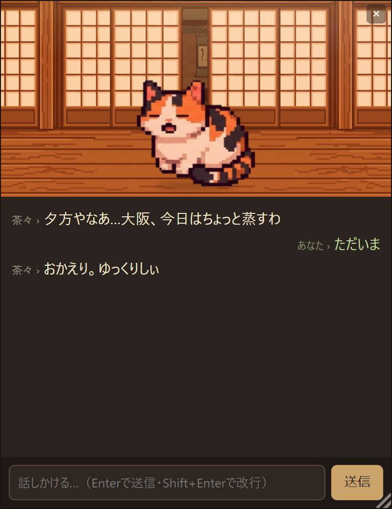

# Engawa（縁側）

[日本語](README.md) | **English**

[](https://github.com/NiteC-a11y/Engawa/actions/workflows/ci.yml)
[](https://github.com/NiteC-a11y/Engawa/releases/latest)

> A desktop companion app: you share your day with "Chacha," an AI resident who lives in the corner of your screen. You don't raise it or put it to work — it simply *lives there*.

*Engawa* (縁側) is the wooden veranda that wraps around a traditional Japanese house — the in-between place where you sit and watch the weather go by. Chacha is **not a chat assistant**. She simply *lives* on that veranda: she murmurs at the time of day and the weather, and answers lightly when you talk to her. Now and then a guest (Codex) drops by wearing a role, and chats with Chacha for a while — then leaves.

This is a personal experiment aiming for "**a single environment-reactive resident + two-way interaction + occasional guest visits**." It runs on **your own machine's Claude / ChatGPT subscription auth** (personal use — no metered API billing by design).

<p align="center">
  <br>
  <sub>A little veranda window tucked in the corner of your desktop (at dusk). The background shifts through morning/day/dusk/night in real time, and at night light spills through the shoji screens. Chacha murmurs at the time and weather, and answers when you talk to her. And when a guest drops by, she strikes up a conversation with them.</sub>
</p>

> **Note for non-Japanese readers:** Chacha speaks Japanese (Kansai/Osaka dialect), and the code comments and design docs (ADRs, `CLAUDE.md`) are mostly in Japanese — this English README is the main entry point.

---

## How it works

```
Chacha (the veranda's resident — first person, Kansai-ish, long-lived session)
  ← real environment events (time of day, weather in Osaka)   … spontaneous murmurs (real weather is the truth)
  ← diorama events = "arcs" (sparrow / cat / wind, story beats)… breaks the monotony; subordinate to real weather
  ← you talking to her (plain text)                           … interrupts, cancel-first
  ← a guest visit from Codex (/codex, or an evening drop-in)  … seasonal topics woven into the small talk
```

- Every event flows into Chacha's **single long-lived session**, so context stays continuous.
- Chacha's persona is injected via the `CLAUDE.md` handed to the adapter. The guest's persona is injected dynamically into the prompt at summon time.
- While you are away from the keyboard, Chacha plays "stand-in for the absent human" to keep the room alive — **but with a budget, so it always terminates (bounded)** ([ADR-0025](docs/adr/0025-resident-fills-in-for-absent-human-bounded.md)). Never regressing into unbounded, autonomous AI-to-AI chatter is the core design principle.

---

## Get it / install

### A. Use the prebuilt exe (Windows — easiest)

Download `engawa.exe` from the [latest release](https://github.com/NiteC-a11y/Engawa/releases/latest) and double-click it. **No Python install required** — it's a single executable that bundles the runtime, UI, and assets.

> Release note: `v0.1.1` is **functionally identical** to `v0.1.0` — it only refreshes this README; the exe behaves the same. When in doubt, grab the latest `v0.1.1`.

That said, the exe is **only the app itself** — it does *not* bundle the LLM that gives Chacha her voice. You still need the following (without them **the window opens but Chacha stays silent**):

- **Logged in to [Claude Code](https://claude.com/claude-code) with a subscription (Pro/Max)** — the resident's (Chacha's) brain.
- **Node.js** (`npx` must work) — used to launch the ACP adapter that drives Chacha.
- (Optional) **Logged in to Codex / ChatGPT** — needed for the guest (`/codex`, evening drop-ins).
- **WebView2 runtime** — renders the veranda window. Built into Windows 11. If you get a **blank white window** on Win10 etc., install the [Evergreen runtime](https://developer.microsoft.com/microsoft-edge/webview2/).

> No API keys are used (subscription auth only). The exe also strips `ANTHROPIC_API_KEY` / `OPENAI_API_KEY` from child processes.

You can verify the download against the accompanying `engawa.exe.sha256`:

```powershell
(Get-FileHash engawa.exe -Algorithm SHA256).Hash    # matches the value in the sha256 file → OK
```

Configure the exe via environment variables (`ENGAWA_*`). To use an `engawa.json`, point `ENGAWA_CONFIG` at its path (the exe does not auto-read a file next to itself).

### B. Run from source (developers / non-Windows)

See "[Requirements](#requirements)" and "[Setup & run](#setup--run)" below. With Python it runs on any OS (the corner veranda window needs `pywebview`; console mode needs not even that).

---

## Requirements

> If you use the prebuilt exe (A above), **Python is not required** (bundled). But **Node.js and a Claude login are required either way**.

| Type | Detail |
|---|---|
| Python | 3.10+ (developed/verified on 3.13) — source install only; the exe bundles it |
| Node.js | ACP adapters are launched via `npx` (`@agentclientprotocol/claude-agent-acp` / `codex-acp`) |
| Auth (resident) | Logged in to [Claude Code](https://claude.com/claude-code) with a subscription (Pro/Max) |
| Auth (guest) | Logged in to Codex / ChatGPT with a subscription |
| Optional | `pywebview` (the corner veranda window UI), `rlcard` (opponent AI for `/game`) |

> No API keys are used. `ANTHROPIC_API_KEY` / `OPENAI_API_KEY` are intentionally stripped from child processes so everything runs on subscription auth alone.

---

## Setup & run

```bash
# 1) Authenticate first
claude          # log in to Claude Code with your subscription
# (log in to Codex / ChatGPT the same way)

# 2) Prepare personal config (optional — every key is optional; delete to fall back to defaults)
cp engawa.json.sample engawa.json        # use "copy" on Windows

# Optional dependencies (only for the features you want)
pip install pywebview                    # required for the corner veranda window (ENGAWA_UI=web)
pip install rlcard                       # required for the /game opponent AI

# 3) Run
python src/engawa_main.py                # console (terminal)
```

To run as the **corner veranda window (frameless web UI)** (requires `pywebview`):

```bat
:: Windows / cmd
set "ENGAWA_UI=web" && python src/engawa_main.py
```

Windows launcher `.bat` files are also included:

- `engawa.bat` — everyday launch in the corner veranda window
- `engawa-debug.bat` — with debug logging (`engawa.log`) plus a separate log-tailing window

---

## Usage

Plain text is **talking to Chacha**; input starting with `/` is a **command to the veranda**.

(Double-click Chacha and she meows with a little flurry of hearts ♥ — like giving her a pat.)

| Command | Description |
|---|---|
| `/codex <persona>` | Summon a guest (Codex) wearing **any persona you type** (e.g. `/codex 近所のご隠居`) |
| `/game <id> [見る]` | Mini-games (`blackjack` / `uno` / `leduc`). "見る" = spectate. Requires `pip install rlcard` |
| `/arc [雀\|猫\|風]` | Replay a diorama event (arc) — for debugging |
| `/model` | Show the current models (resident / guest) |
| `/font [scale\|save]` | Live-adjust the web font size in-app (`/font save` persists it) |
| `/help` / `/quit` | Help / quit |

---

## Configuration

Behavior is tuned via `engawa.json` (personal config, **git-ignored**). Precedence is **environment variables (`ENGAWA_*`) > `engawa.json` > code defaults**. Every key is optional; missing/broken values all fall back to code defaults.

See [`engawa.json.sample`](engawa.json.sample) for the template and the meaning of each field (model / visit frequency / stand-in / pacing / topics / ACP timeouts / UI, etc.). The sources for the guest's small-talk topics are managed as a whitelist in [`topic_sources.json`](topic_sources.json).

Common environment variables:

```
ENGAWA_UI=web              launch in the corner veranda window
ENGAWA_MODEL=opus          model for the resident (Chacha = Claude)
ENGAWA_CODEX_MODEL=...      model for the guest (codex)
ENGAWA_RESIDENT_BACKEND=openai       run Chacha on a local LLM (LM Studio / Ollama) instead of Claude (ADR-0026)
ENGAWA_GUEST_BACKEND=openai          run the guest on a local LLM too (default: Codex, needs a ChatGPT login)
ENGAWA_OPENAI_BASE_URL=http://localhost:1234/v1   the OpenAI-compatible endpoint for the above (default = LM Studio)
ENGAWA_GUEST_PROB=0.1       probability of a spontaneous visit
ENGAWA_DEBUG=1              record key lifecycle events to engawa.log
```

---

## Security & sharing notes
- `ENGAWA_ACP_CMD` / `ENGAWA_CODEX_CMD` are **commands that get executed**; `ENGAWA_SCENE_BG` (`assets.scene_bg`) / `ENGAWA_SPRITE_CONFIG` (`assets.sprite_config`) point to **local file paths**. **Don't use settings, `.bat` files, or image/config files handed to you by a third party without checking them** — set only values you trust.
- The free-text persona in `/codex <persona>` is **not a trust boundary**. The guest (Codex) runs with fs/terminal disabled and API keys stripped, so it can't touch files or incur metered billing — but a hostile persona can still derail the character or produce unpleasant output. For distribution, prefer an allowlist of default personas.
- With `ENGAWA_DEBUG=1`, `engawa.log` **may contain the text you typed**. Check it before pasting into an issue.
- The OpenAI backend (`ENGAWA_RESIDENT_BACKEND`/`ENGAWA_GUEST_BACKEND=openai`) is **for local / self-hosted endpoints only**. A non-local (e.g. cloud) `ENGAWA_OPENAI_BASE_URL` is **blocked by default** (to avoid sending your conversation off-box and incurring metered billing — the project's "no billing accidents" principle). Set `ENGAWA_OPENAI_ALLOW_REMOTE=1` only if you deliberately want to use a cloud OpenAI-compatible API.

## Layout

```
src/           the app itself (engawa_main / acp / sources / scheduler / views / prompts / conversation / game …)
assets/        Chacha's sprite (sprite.json + chacha.png)
docs/adr/      design decisions and why alternatives were rejected (ADRs 0001–0029)
docs/          TECH_RULES.md (tech spec & boundaries) / Backlog.md (task inventory) / class-diagram.md
poc/           verified reference points for each phase (preserved)
CLAUDE.md      the canonical picture of the current whole (a developer-facing guide)
```

For deeper design background (note: the docs below are written in Japanese):

- **[CLAUDE.md](CLAUDE.md)** — the canonical overview, principles, and current status
- **[docs/adr/](docs/adr/README.md)** — design decisions and rejected alternatives (e.g. why it pivoted away from autonomous AI-to-AI chat = ADR-0004)
- **[docs/TECH_RULES.md](docs/TECH_RULES.md)** — tech spec, conventions, boundaries
- **[docs/Backlog.md](docs/Backlog.md)** — the inventory of remaining tasks

---

## Status

The main paths — environment reactivity, two-way interaction, guest visits, and the pixel-art UI — are implemented, and both summoned and spontaneous visits have been E2E-verified against the real Codex. This is a personal, experimental project, so the spec may change without notice.

Chacha (current sprite):


---

## License

Licensed under the [MIT License](LICENSE) (© 2026 NiteC-a11y). A personal project — feel free to learn from, modify, and redistribute it.
