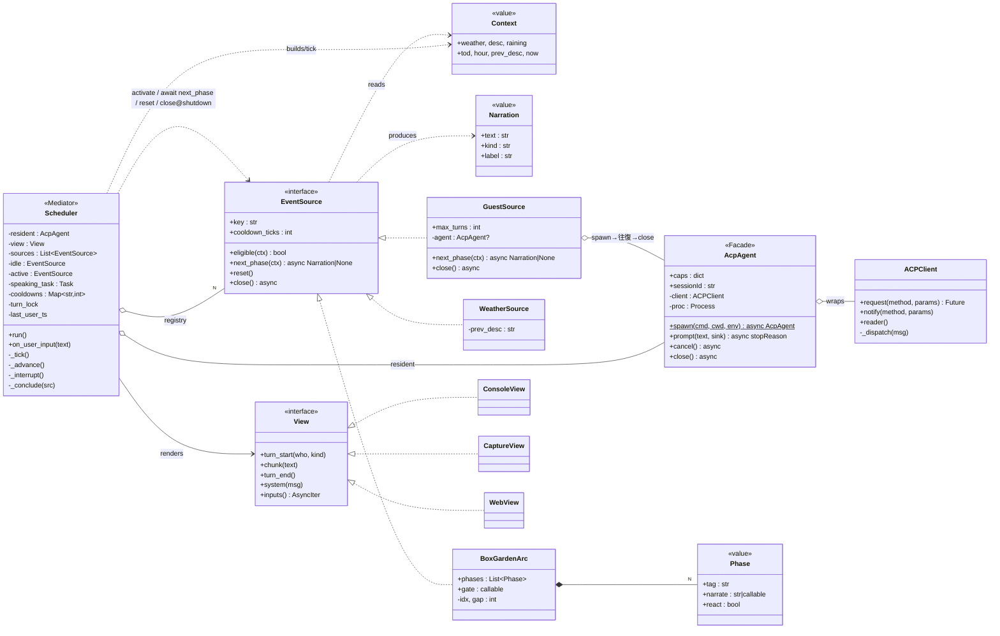

# ADR-0013: イベント源／スケジューラのアーキテクチャ（ADR-0011 の実装構造）

- ステータス: Accepted（実装済み 2026-06-27：`acp.py` / `sources.py` / `scheduler.py` / `views.py` / `engawa_main.py`）
- 日付: 2026-06-27
- 関連: ADR-0011, ADR-0008, ADR-0012, ADR-0006, TECH_RULES §2/§5, spec §11

## 背景 / 課題
P3.5 時点で、スケジュール処理が `ambient_loop` の if/elif（天気取得・アーク前進・新規開始・つぶやき・移ろい）に集約され、god-method 化の兆しがある。
これから来る2つが、具体的な軋みを強いる:
- **P4（来訪）**= codex の **2本目の ACP 接続**＋使い捨てセッション。今の `main()` は1接続前提で spawn/init/session を直書きしており、二重化する。
- **P5（UI）**= pywebview。core が `stdin_reader` / `sys.stdout.write` に直結していて、UI に差し替えられない。
ADR-0011 は「全イベントはアーク／イベント源」と決めたが、実装はまだ源を第一級オブジェクトにしていない。検証の過程で、テストハーネスが `speak` を monkeypatch し stdout を parse せざるを得なかった＝**出力の継ぎ目が無い**証拠も出た。

## 決定
将来の仕様追加が確実に強いる **3つの継ぎ目だけ** にパターンを当てる。それ以外は YAGNI で見送る。

1. **EventSource（源）＝ナレーションを産むプロデューサ ＋ Scheduler（Mediator）。**
   - `EventSource`: `eligible(ctx)`（実天気/時刻ゲート＝ADR-0012）／`async next_phase(ctx) -> Narration|None`（1回=単発／N回=アーク／往復=来訪、None で終了）／`reset()`（1 run 後のカーソル初期化）／`cooldown_ticks`（設定値）／`async close()`（**shutdown 時の全 teardown 専用**）。
   - 間合い（ティック・隙間）は **Scheduler が支配**し、源は呼ばれた時の `ctx` を読んで分岐する。
   - **来訪（ADR-0008）も EventSource。** guest 源の `next_phase` が codex の session/new→往復→ナレーション化→**visit 終了時に内部で agent を破棄（spawn↔close を対に）**を回す。茶々への注入・turn_lock・割り込み後の背景継続は **Scheduler が一律に持つ**。
   - **割り込み（ADR-0006）の cancel 対象は resident の注入ターン（`resident.cancel()`→session/cancel→stopReason=cancelled）に限り、source のカーソル（`next_phase` の状態）は触らない**。だから QUIET 明けに同じ `active` から継続できる（Test C で実証）。
   - **`close()` は再利用 source（雀/猫/天気）の per-run 後始末ではない**：結了時は `reset()`+cooldown のみ。`close()` は `run()` finally の全 teardown 専用（guest の使い捨て agent も最終防波堤としてここで取り残しを刈る）。
   - 源は registry に登録（Open-Closed）。イベント追加＝源の登録であり、loop は不変。

2. **AcpAgent（接続の Facade）＋ Factory。**
   - process ＋ ACPClient ＋ sessionId ＋ capabilities を1クラスに束ね、`spawn()` を factory に（resident=claude / guest=codex）。
   - capability は **agent ごとに initialize 応答から読む**（TECH_RULES §2「固定で仮定しない」）＝この状態がここに収まる。

3. **View ポート（Observer/Presenter）で core を console から剥がす。**
   - core は `turn_start / chunk / turn_end / system` を emit するだけ。`ConsoleView` を今、`WebView` を P5 で差す。
   - テストは `CaptureView`（event を拾う）で stdout parse を廃す。

## 検討した代替案
- **現状維持（if/elif を増やす）**: P4 の guest producer と P5 の UI が乗らない／god-method 化。却下。
- **全面パターン適用（State machine・Repository・Template Method も今）**: 動く PoC への過剰設計。却下。features が実際に来てから当てる。
- **ACPClient を作り直す**: 既に良い分離。触らない。

## 影響 / 帰結
- ADR-0011 の「全部アーク」がコード構造として実体化。**P4 は guest を1つの EventSource として足すだけ**になる。
- **P5 は View を差すだけで core 不変。** 検証も CaptureView で楽になる。
- `engawa_p3_interactive.py` は基準点として温存し、`engawa_p35_arc.py` を①の形へ移植（移植後に削除）。移植後 **Test A/B/C 相当を CaptureView で再走**し挙動同一を確認済み。

## 備考（YAGNI で今は見送る）
- アークの本格 State machine（分岐/永続化が実際に来るまで）。
- 永続化 Repository（SQLite spec §11 を足す時に被せる）。
- ナレーションの Template Method（①移植時に源側へ寄れば自然に解消）。

---

## クラス図（目標構成）

> 上の①②③をクラスに落としたもの。**実装済み**（`acp.py` / `sources.py` / `scheduler.py` / `views.py` / `engawa_main.py`）。`engawa_p3_interactive.py` は検証済み基準点として温存、`engawa_p35_arc.py` は移植のうえ削除。



### 凡例 / 役割
- 線: `o--` 集約 ／ `*--` 合成 ／ `<|..` 実装 ／ `..>` 依存（読む・産む）
- `WeatherSource` … idle/fallback の源。前ティック差分の「移ろい」もここ（ADR-0012）。
- `GuestSource` … P4。自前の codex を `AcpAgent` で持つ使い捨ての源＝「重いアーク」（ADR-0008/0011）。
- `CaptureView` … テスト用（stdout parse を廃止）。`WebView` … P5（pywebview）。
- 配線役 `engawa_main`（composition root）は図から省略：`AcpAgent.spawn()` → 源を registry 登録 → `Scheduler(resident, sources, ConsoleView).run()`。
- `EventSource.next_phase()` / `close()` は **async**（ACP I/O・timeout・cancel・process close を含むため、同期APIに見せない）。
- **cooldown は2層に分離**：`EventSource.cooldown_ticks`＝設定値（不変）、`Scheduler.cooldowns: Map~str,int~`＝実行時の残りティック。混ぜない。
- **割り込みの cancel 対象（#1）**：`Scheduler.speaking_task`＝進行中の `resident.prompt()` 注入ターン**のみ**。割り込みは `resident.cancel()`（session/cancel）でこれを stopReason=cancelled に畳む。**`active`(source) と `next_phase()` は asyncio-cancel しない**＝カーソル保持 → QUIET 明けに背景継続（Test C で実証）。
- **close の意味（#2）**：`close()` は **shutdown 時の全 teardown 専用**（`run()` の finally が全 source ＋ resident に1回）。**source 結了（`next_phase`→None）では `_conclude` が `reset()`+cooldown のみ**で、再利用 source（雀/猫/天気）は破棄しない。**guest の使い捨て agent は `GuestSource` 内部で「visit 開始＝spawn／visit 終了＝close」と対にする**（カプセル化）。finally の close() は取り残し対策の最終防波堤。

### 1ティックのデータフロー
```text
Scheduler._tick()
  cooldowns を全 source デクリメント
  ctx = build(Context)                              # 実天気/時刻（ADR-0012）
  active あり? → await active.next_phase(ctx) → Narration | None
       （GuestSource は visit 開始で codex を spawn、None を返す直前に内部で close）
       None なら _conclude(active):                 # 再利用 source は破棄しない
            active.reset() ; cooldowns[active.key] = active.cooldown_ticks ; active = None
  active なし → eligible(ctx) かつ cooldowns[key]<=0 の source を activate
                （無ければ idle=WeatherSource or 沈黙）
  speaking_task = create_task(resident.prompt(narration.text, sink=view))   # 茶々への注入ターン
  await speaking_task
     └ ACPClient のチャンク → view.chunk()（turn_start/turn_end も）

on_user_input(text):                                 # 別経路から割り込み
  speaking_task が進行中 → await resident.cancel()    # session/cancel → stopReason=cancelled
  # active(source) と next_phase のカーソルは触らない → QUIET 明けに同じ active から継続（背景継続）
  ユーザーターンを最優先で注入

run() の finally: 全 source.close() ＋ resident.close()   # shutdown teardown（leak 最終防波堤）
```
