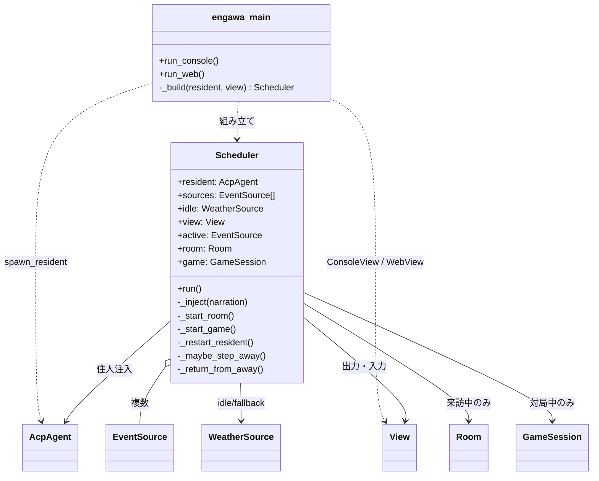
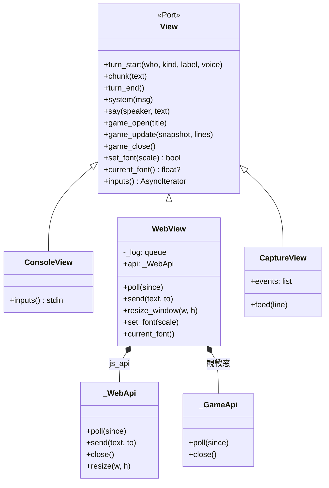
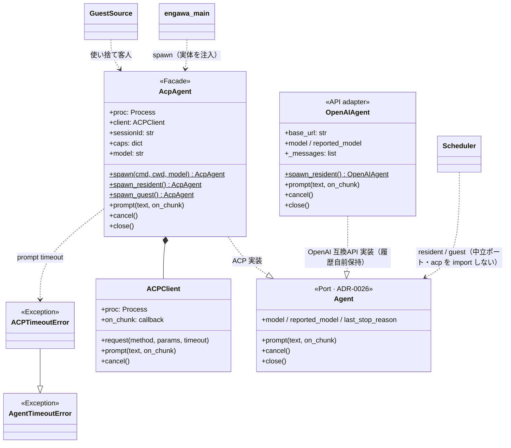
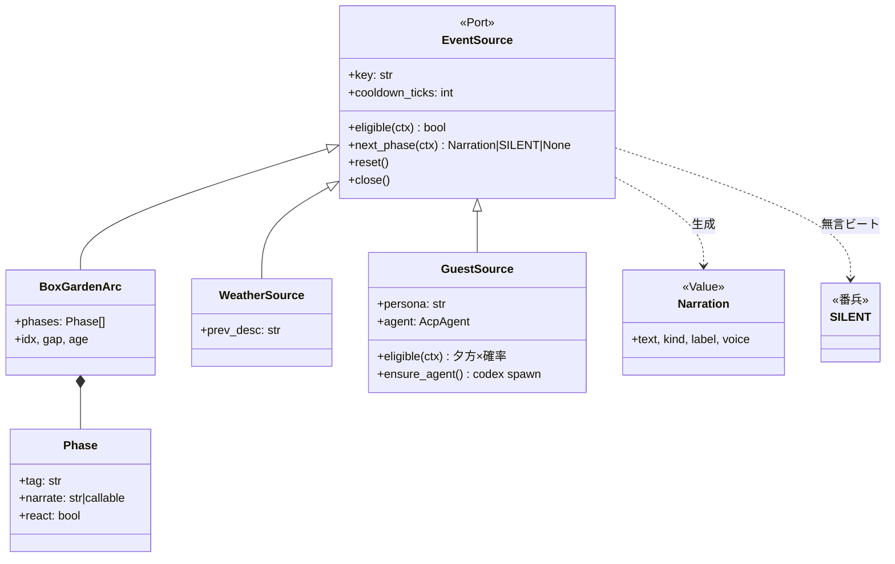
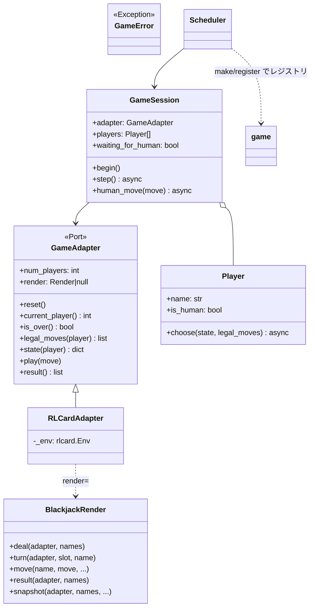
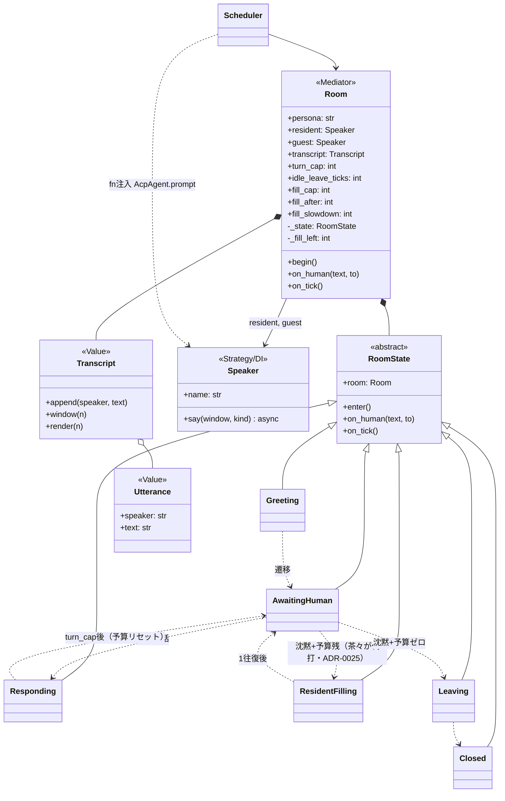
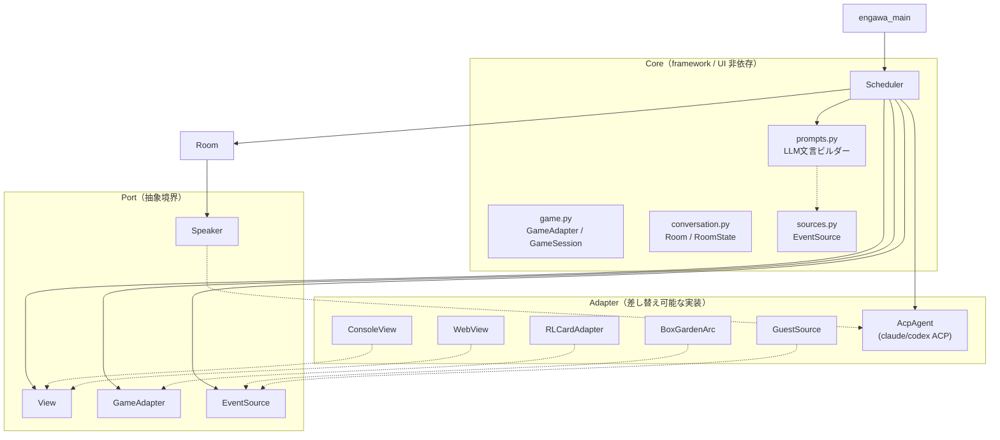

# Engawa クラス図（Mermaid）

`src/` の現行構成を Mermaid 記法で整理したもの。Port & Adapter 境界（ADR-0013 / 0015 / 0017）を含む。

> 実装は ABC ではなく duck typing（`NotImplementedError` / `...`）のため、ポートは `<<Port>>` として表記。

---

## 全体構成（Composition Root → Mediator）

---

## Port & Adapter ① — View（出力・入力ポート）

ADR-0013 ③。`Scheduler` は `View` だけ知り、console / web / テスト用実装を差し替える。

---

## Port & Adapter ② — ACP（エージェント接続）

ADR-0013 ②＋**ADR-0026**。LLM 接続の中立ポート `Agent`（`prompt/cancel/close`）の背後に**2アダプタ**: `AcpAgent`（外部 `claude-agent-acp`/`codex-acp` を包む・Claude Code サブスク）と `OpenAIAgent`（ローカル OpenAI 互換 API＝LM Studio 等・API はステートレスなので履歴を自前保持）。`Scheduler` は `Agent` と中立 `AgentTimeoutError` だけを知り実体を知らない＝住人/客人とも backend を `ENGAWA_RESIDENT_BACKEND`/`ENGAWA_GUEST_BACKEND` で選択（客人 openai は persona を prompt 注入・住人と同じ endpoint 共有）。

---

## Port & Adapter ③ — EventSource（環境イベント源）

ADR-0013 ①。`Scheduler` が抽選・駆動する「源」のポート。

---

## Port & Adapter ④ — Game（ゲーム核 + RLCard アダプタ）

ADR-0017。`game.py` は framework 非依存、`game_rlcard.py` が RLCard を `GameAdapter` に合わせる。

---

## 3人会話（State パターン + Strategy/DI）

ADR-0015。`Room` が Mediator、`Speaker` が茶々/客人の注入アダプタ、`RoomState` がターン管理。

---

## レイヤー関係（Port & Adapter の見取り図）

---

## 設計上のポイント

| 境界 | ポート | 主なアダプタ |
|------|--------|--------------|
| 出力・入力 | `View` | `ConsoleView`, `WebView`, `CaptureView` |
| LLM 接続 | （明示 Port なし） | `AcpAgent` + 外部 ACP アダプタ |
| 環境イベント | `EventSource` | `BoxGardenArc`, `WeatherSource`, `GuestSource` |
| ゲーム | `GameAdapter` | `RLCardAdapter`（+ `BlackjackRender`） |
| 3人会話の発話 | `Speaker`（DI） | Scheduler が `AcpAgent.prompt` を fn として注入 |
| LLM 文言生成 | （Port なし・関数群） | `prompts.py`（注入プロンプト工場・`sources` から分離・`prompts→sources` 一方向） |
| スラッシュコマンド | `Command`／`CommandRouter`（登録制） | `commands.py`（`FontCommand`/`DayNightCommand`＋薄い `CommandContext`・`Scheduler._command` が委譲・adr/0029 Phase 1。残コマンドは controller 抽出に合わせ移行） |
| 背景の昼夜 tint | （Port なし・純関数） | `daynight.py`（時刻→`{tint,glow,lamp}`・`WebView.poll` が大阪時刻で配信→JS が #scene の膜3枚［乗算tint＋月明かりglow＋室内灯lamp］へ・adr/0028。`/daynight` プレビューの仮想時刻解決＝`parse_override`/`override_minute`/`effective_layers` も純関数） |
| デバッグログ | （stdlib logging ラッパ） | `debuglog.py`（`ENGAWA_DEBUG=1`→`engawa.log`・既定オフ＝no-op・各モジュールは `get("<name>")` の子ロガー） |

`engawa_main.py` が composition root で、`Scheduler` が Mediator として各 Port を結線する（ADR-0013）。`prompts.py` は Scheduler だけが呼ぶ LLM 文言ビルダー（`user_narration`/`room_*_prompt`/`game_move_prompt`/中座の `absence_leave`・`absence_return` 等）を `sources.py` から切り出したもの＋茶々ソロ出力の染み出しガード `strip_resident_leak`（純関数・注入文の復唱＋地の思考を表示前に除去）。`debuglog.setup` は composition root が1度だけ呼ぶ（既定オフ＝縁側の窓/console 本文は汚さない）。

## 参照

- `docs/adr/0013-event-source-scheduler-architecture.md`
- `docs/adr/0015-visitor-bounded-three-way-conversation.md`
- `docs/adr/0025-resident-fills-in-for-absent-human-bounded.md` — 人間待ちの間、茶々が代打で場をつなぐ（`ResidentFilling`・有界）
- `docs/adr/0017-games-via-port-and-rlcard-adapter.md`
- `codex/review-cursor-2026-06-30-architecture-boundaries.md` — 本図を基にした境界レビューと Action Items
